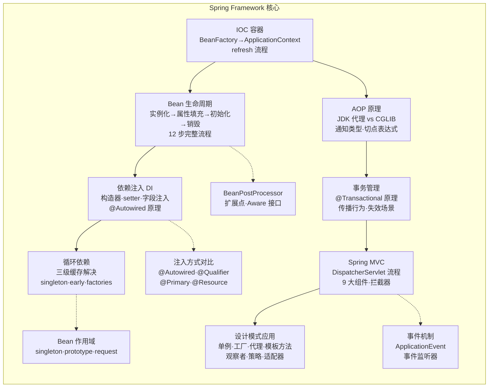

```mermaid
flowchart TB
    subgraph Spring["Spring Framework 核心"]
        direction TB
        S1["IOC 容器<br/>BeanFactory→ApplicationContext<br/>refresh 流程"] --> S2["Bean 生命周期<br/>实例化→属性填充→初始化→销毁<br/>12 步完整流程"]
        S2 --> S3["依赖注入 DI<br/>构造器·setter·字段注入<br/>@Autowired 原理"]
        S3 --> S4["循环依赖<br/>三级缓存解决<br/>singleton·early·factories"]
        S1 --> S5["AOP 原理<br/>JDK 代理 vs CGLIB<br/>通知类型·切点表达式"]
        S5 --> S6["事务管理<br/>@Transactional 原理<br/>传播行为·失效场景"]
        S6 --> S7["Spring MVC<br/>DispatcherServlet 流程<br/>9 大组件·拦截器"]
        S7 --> S8["设计模式应用<br/>单例·工厂·代理·模板方法<br/>观察者·策略·适配器"]
        S2 -.-> S9["BeanPostProcessor<br/>扩展点·Aware 接口"]
        S3 -.-> S10["注入方式对比<br/>@Autowired·@Qualifier<br/>@Primary·@Resource"]
        S4 -.-> S11["Bean 作用域<br/>singleton·prototype·request"]
        S7 -.-> S12["事件机制<br/>ApplicationEvent<br/>事件监听器"]
    end
```

