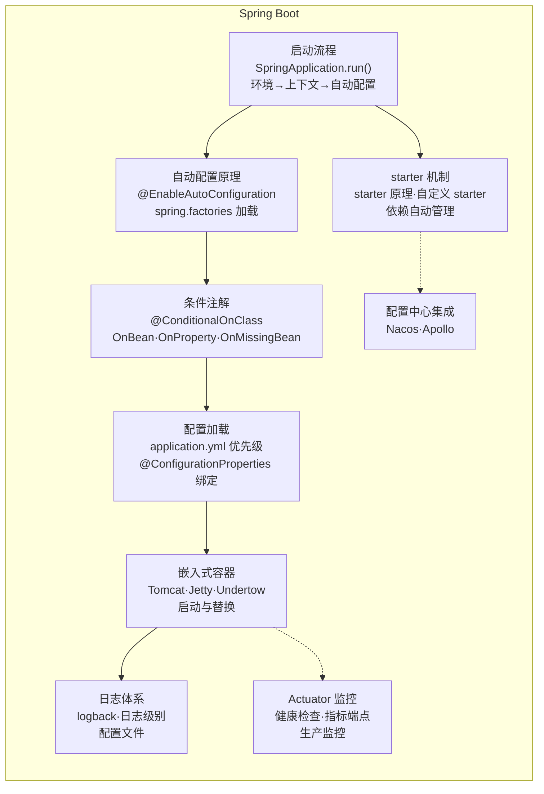

```mermaid
flowchart TB
    subgraph SpringBoot["Spring Boot"]
        direction TB
        B1["启动流程<br/>SpringApplication.run()<br/>环境→上下文→自动配置"] --> B2["自动配置原理<br/>@EnableAutoConfiguration<br/>spring.factories 加载"]
        B2 --> B3["条件注解<br/>@ConditionalOnClass<br/>OnBean·OnProperty·OnMissingBean"]
        B3 --> B4["配置加载<br/>application.yml 优先级<br/>@ConfigurationProperties 绑定"]
        B4 --> B5["嵌入式容器<br/>Tomcat·Jetty·Undertow<br/>启动与替换"]
        B1 --> B6["starter 机制<br/>starter 原理·自定义 starter<br/>依赖自动管理"]
        B5 --> B7["日志体系<br/>logback·日志级别<br/>配置文件"]
        B6 -.-> B8["配置中心集成<br/>Nacos·Apollo"]
        B5 -.-> B9["Actuator 监控<br/>健康检查·指标端点<br/>生产监控"]
    end
```
