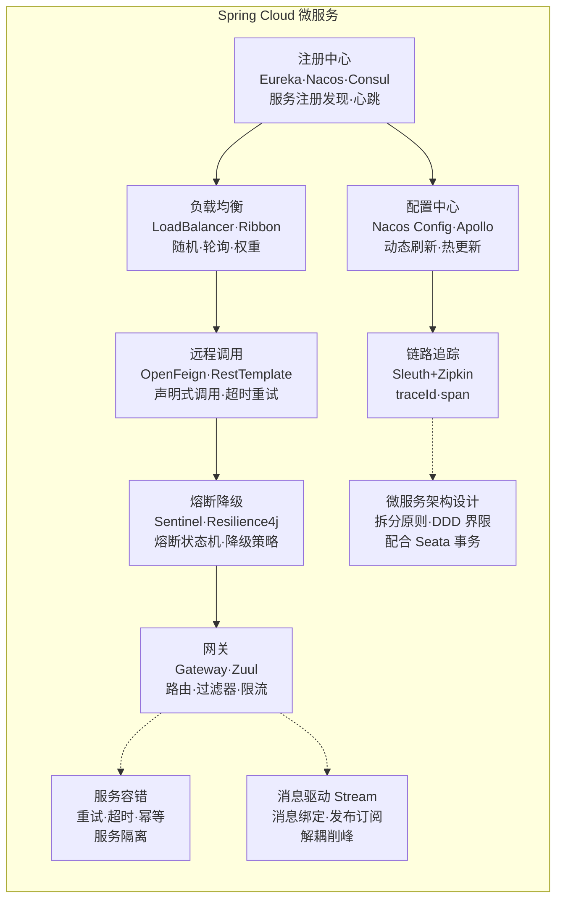

```mermaid
flowchart TB
    subgraph SpringCloud["Spring Cloud 微服务"]
        direction TB
        C1["注册中心<br/>Eureka·Nacos·Consul<br/>服务注册发现·心跳"] --> C2["负载均衡<br/>LoadBalancer·Ribbon<br/>随机·轮询·权重"]
        C2 --> C3["远程调用<br/>OpenFeign·RestTemplate<br/>声明式调用·超时重试"]
        C3 --> C4["熔断降级<br/>Sentinel·Resilience4j<br/>熔断状态机·降级策略"]
        C4 --> C5["网关<br/>Gateway·Zuul<br/>路由·过滤器·限流"]
        C1 --> C6["配置中心<br/>Nacos Config·Apollo<br/>动态刷新·热更新"]
        C6 --> C7["链路追踪<br/>Sleuth+Zipkin<br/>traceId·span"]
        C5 -.-> C8["服务容错<br/>重试·超时·幂等<br/>服务隔离"]
        C7 -.-> C9["微服务架构设计<br/>拆分原则·DDD 界限<br/>配合 Seata 事务"]
        C5 -.-> C10["消息驱动 Stream<br/>消息绑定·发布订阅<br/>解耦削峰"]
    end
```

